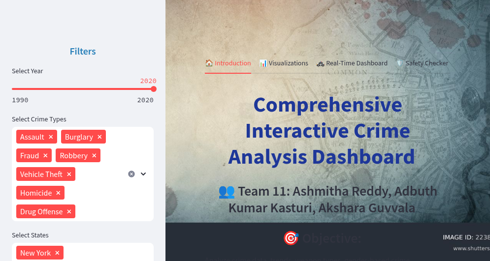

# Crime Analysis Dashboard

## App Deployment URL
https://akshara-117-crime-analysis-das-va-project-finalvapython3-hrq9lb.streamlit.app/
### 🖼️ Dashboard Preview  


## Overview

This project analyzes crime data using Python, focusing on trends over the years, common crime types, and the relationship between total crimes and crimes solved. The analysis is performed using the `pandas`, `altair`, `folium`, and `streamlit` libraries for data manipulation and visualization.

The Streamlit app provides interactive features for exploring crime trends, weapon types, gender-based crime distribution, and even a real-time city-wise crime data dashboard.

## Local Setup Instructions

### Prerequisites
- Python 3.x
- Git

### Installation and Running the App Locally
1. Clone the repository:

    ```bash
    git clone <your-repository-url>
    cd <repository-folder>
    ```

2. Install the dependencies:

    ```bash
    pip install -r requirements.txt
    ```

3. Run the Streamlit app:

    ```bash
    streamlit run VApython3.py
    ```

### Datasets
- **crime_data.csv**: Contains crime data for various US cities.
- **cleaned_weapon_data.csv**: Contains weapon data related to crimes.
- **Hate_Crimes.csv**: Contains data on hate crimes, including bias motivations.
- **crime_data_usa.csv**: Contains the overall crime data for analysis.

Ensure that the datasets are correctly placed in the repository or update the file paths in the code to match their location in the repo.

## Description
This Streamlit app allows for interactive analysis of crime data, visualizing trends across different US cities, analyzing weapon types, gender-based crime distributions, and more. It includes features such as:
- Crime trends across states and years.
- Top dangerous and safest states.
- Weapon and bias crime analysis.
- Real-time city-wise crime data.
- A crime safety checker tool.

## Requirements

To run this project, ensure you have the following Python packages installed:

- pandas
- altair
- folium
- streamlit
- streamlit-folium
- requests

You can install these packages using pip:

```bash
pip install pandas altair folium streamlit streamlit-folium requests
